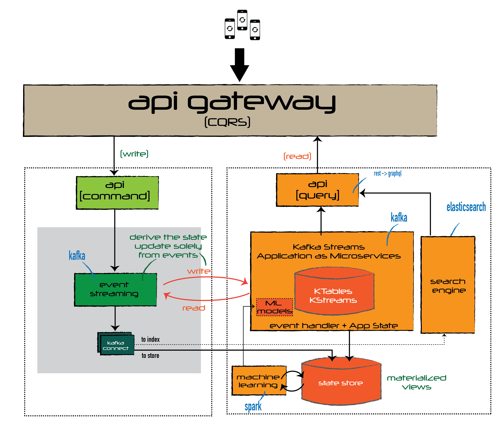
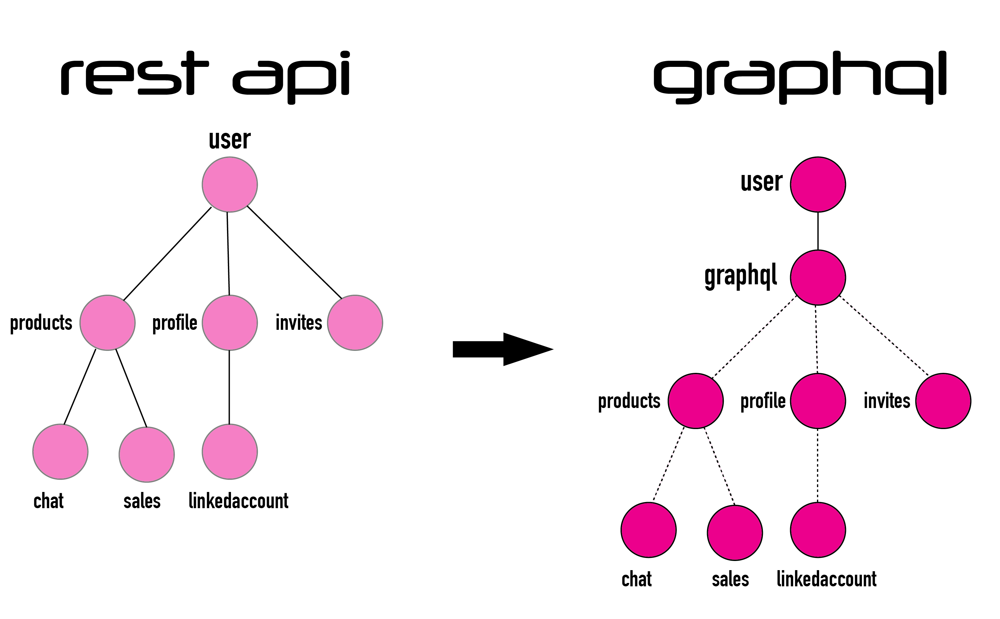

# Challenge 1

## Situation


>We need to build a tracking API for our apps. We expect to receive 1.000.000 requests per second. These collected data will be consumed in two ways:
>* by several microservices, which must respond to requests like to retrieve all the events from a user, allowing filtering by date or type of the event.		
>* for report generation and analytics, aggregating over users groups, event types by day and product categories.
>

## Task

>Choose the different technologies and draw diagrams for the 
architecture for the API, the persistence system and the data model.


## Solution

### Rationale

The challenges faced here are:
* large volume of data ingestion in short interval of time
* serve and filtered ingested data in real time
* daily batch reporting

### Implementation

* In order to ingest such large volume of data ingestion, one must move the data in a *_fast  and reliable way_*  from where it is originated, into a next layer where it can be processed in real time or in batch mode. 

* In order to serve processed data in real time always up to date one must use immutable data (to prevent multiple data states) and use the events that change the data state as the *Single Source of Truth*.

* In order to do the daily batch report one must use the materialized view of data on a permanent data store.


The common choice for this ingestion layer in BigData projects currently if *Apache Kafka*. Kafka allows to ingest data in a pure redundant, distributed and easily scalable manner.

Regarding the consumption of the data one must decide on the architecture what will be *Single Source of Truth* for the State of the application. This is an important decision which will distiguish the *real time* system from the *near-real time system*. 


>*Immutable Data* is not new for obtaing data accuracy, where it is an old practice on *Accounting*, where to correct a movement, you don't change the movement, you need to create another movement with opposite value.


#### Proposed Architecture

My choice is to use *EVENT SOURCING* model as the *architecture*. All state changes like data ingestion or data transformation would be stored as an immutable event data. 

All of the following explanations will be based on a single premise and ruling principle:

> *Immutability is the Backbone of “Big Data”*
>Functional Computation with Immutable Inputs. Failure and Restart Are Based on the Idempotent Nature of Functional Computation over Immutable Inputs.



Using this approach, all application or interfaces that require always up to date information will use the _Event Logs_ to create a *real-time materialized view* to be queried, that can be a query or index the event in ElasticSearch for searches.

Another pattern to apply to this architecture is to use *CQRS ("Command Query Responsability Segregation")*, with a twist of *still using the *Event Store* as the *Application State* to queried using real-time analytics with Kafka Streams (this is the evolution that replaces the Apache Spark or Spark Storm for stream processing).

Another characteristic of this approach is that _*events* first-class citizen of the Architecture_, and any state update of the application comes solely from events,  which is completely always up to date and highly distributed and scalable using Distributed Kafka.

This architecture as all components and layers highly scalable, highly resilitent, loose coupled and allows *easy* the replacement of any component.

### Data Model

For the data, the proposal is to start moving the Restful API to a more smart api based on *Graphql*.

Instead of having multiple *dumb* rest endpoints, we can have a *smart* endpoint that can take in complex queries, and then massage the data output into whatever shape the client requests.



The graphql lives between the client and several data sources, the *Event Source*, fetching the requested data according to the query.
```
query {
    user(id: "111") {
        profile {
            name
            avatar
        }
    }
}
``` 
or more elaborated
```
query {
    user(id: "1111") {
        products {
            product1 {
                chat {
                    post1
                    post2
                }
                sale {
                    price
                }
            product2 {
                chat {
                    post1
                }
            }        
        }
    }
}
```


