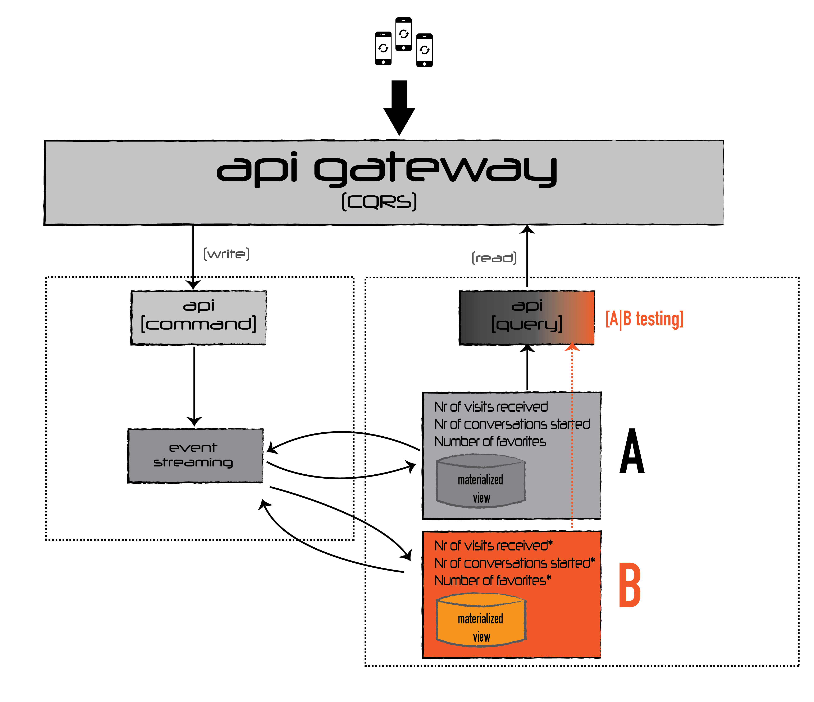

# Challenge 2

## Situation

>We have a system that calculates in real time the following statistics for each of the products of ACME:
>* Number of visits received							 	
>* Number of conversations started				 		
>* Number of favorites

## Task

>Suppose we have detected a bug and the counters did not work. How would you develop a system to fix them?

# Proposed Solution

## Rationale

By using a loosed coupled architecture based on Kafka, and using Event Store for the *SINGLE SOURCE OF TRUTH* with immutable event data, all of the infered data are calculations that can be easily replaced by using *A|B Rolling Upgrade*.

## Implementation

As all the required statistics are calculated fields, I would roll out in parallel a microservice that produces the new calculation, sourcing data from the same Event Source, that has immutable events.

