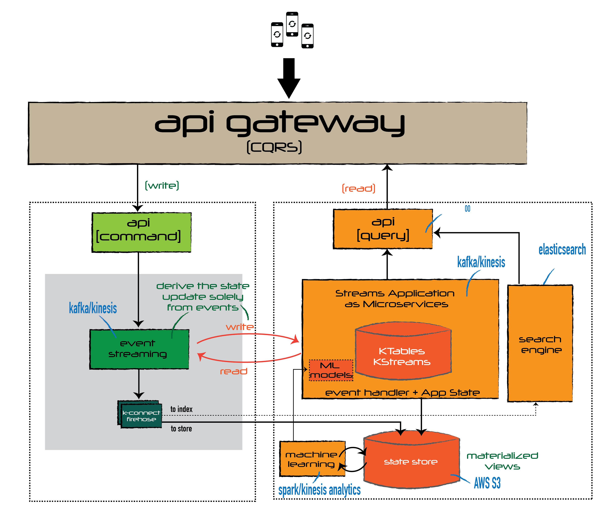

# Challenge 2

## Situation

>We have a system that calculates in real time the following statistics for each of the products of ACME:
>* Number of visits received							 	
>* Number of conversations started				 		
>* Number of favorites

## Task

>Suppose we have detected a bug and the counters did not work. How would you develop a system to fix them?

# Proposed Solution

## Rationale

### Real Time Analytics

For te real time analytics, one must select the event sourcing as it most up to date source of data to be able to give the state of the system. We define the incoming events into the architecture first class citizen, therefore the *single source of truth*.

The real analytics must be done sourcing data directly from the stream.

### Bug Fixing

all of the infered data are calculations that can be easily replaced by using *A|B Rolling Upgrade*.

## Implementation

### Real Time Analytics

By using a loosed coupled architecture based on Kafka or AWS Kinesis, and using Event Store for the *SINGLE SOURCE OF TRUTH* with immutable event data, all of the real analytics will source data from the stream and not from a database.

See example of querying real-time from Kafka using [Kafka Streams application](https://asciinema.org/a/Hb1vSp6U6vSXWG31R9cTZJqDJ)
 
 ### Bug Fixing

As all the required statistics are calculated fields, I would roll out in parallel a microservice that produces the new calculation, sourcing data from the same Event Source, that has immutable events.

