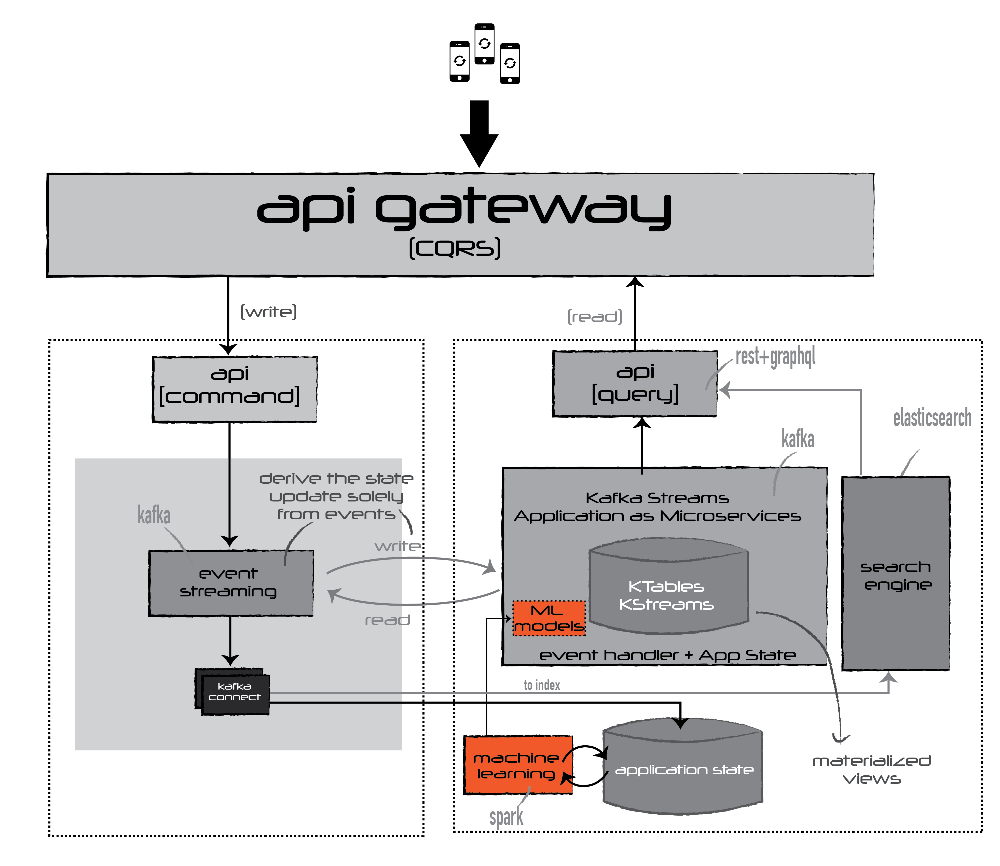

# Challenge 4

## Situation
> From previous cases

## Task
> Describe the typical steps and technologies for building and deploying Machine Learning models. 

## Proposed Solution

The Machine Learning models are developed by accessing the State Database (see diagrams),  by using the data store for Data Exploration and Models Creation. Once Models are created, they are deployed into the stream pipeline. The models are applied to income events on the stream path of the data towards its consumption.

